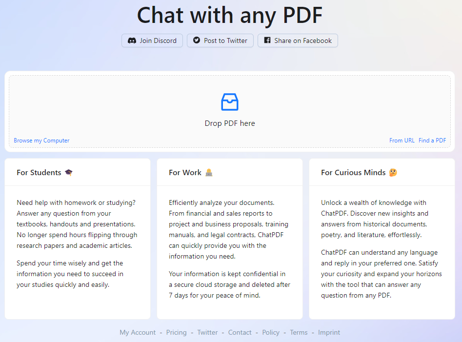

# ChatPDF_zh

**介绍**：是一款基于ChatGPT开发的上传任意PDF，并且基于PDF进行问答系统搭建的软件。

**Note**：目前的免费版最大可传200页的PDF，超过了就要用自己在OpenAI申请的API账户了。 

**体验地址**：https://www.chatpdf.com

## 如何使用

**Step1 上传PDf源文件**
上传了一页理想ONE的汽车说明书

**Step2 基于PDf源文件进行提问**
基于说明书的简单提问demo如下图所示：

