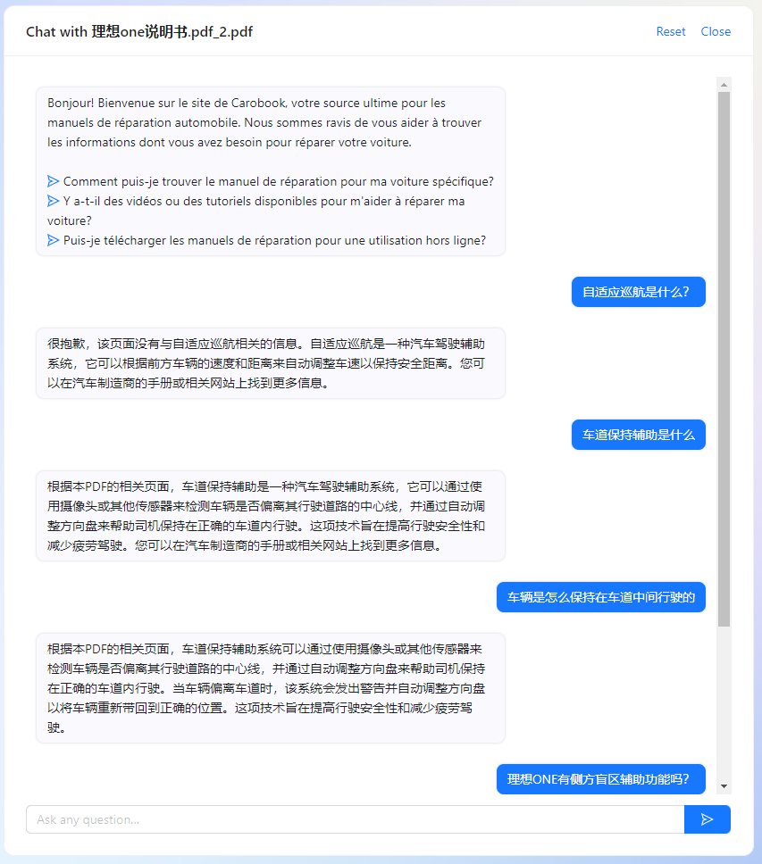

# ChatPDF_zh

**介绍**：是一款基于ChatGPT开发的上传任意PDF，并且基于PDF进行问答系统搭建的软件。

**Note**：据了解，这个体验使用作者的账号，因此需要谨慎使用，避免浪费作者的资源。

**体验地址**：https://www.chatpdf.com/?continueFlag=cc734774b142837d5cb04bc1df00296d

**Step1 上传PDf源文件**
上传了一页理想ONE的汽车说明书

**Step2 基于PDf源文件进行提问**
基于说明书的简单提问demo如下图所示：

