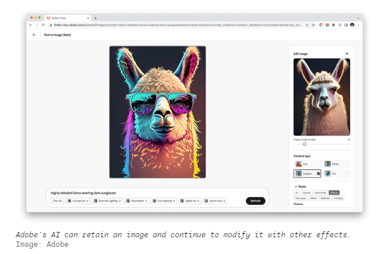

# Firefly_zh

2023年3月21日Adobe制造了一个人工智能图像生成器--并表示它没有窃取艺术家的作品来做这件事。

**官网地址**：https://www.theverge.com/2023/3/21/23648315/adobe-firefly-ai-image-generator-announced

## 以下是官网内容的总结(目前是beta版本)

Adobe终于推出了自己的AI图像生成器。该公司今天宣布了一个名为Adobe Firefly的 "创造性生成AI模型系列"，并发布了利用这些模型的前两个工具。其中一个工具像DALL-E或Midjourney一样工作，允许用户输入提示，并创建一个图像作为回报。另一个生成风格化的文本，有点像人工智能驱动的WordArt。

这对Adobe来说是一次重大的发布。该公司位于创意应用生态系统的中心，在过去一年的大部分时间里，当创意空间的新来者开始提供强大的工具来创建图像、视频和声音时，它一直处于观望状态。在推出时，Adobe称Firefly是一个测试版，它只能通过一个网站提供。但最终，Adobe计划将生成性人工智能工具与其创意应用程序套件（如Photoshop、Illustrator和Premiere）紧密结合。

"我们不害怕变化，我们正在拥抱这种变化，"Adobe公司生成性人工智能和Sensei的副总裁Alexandru Costin说。"我们将这些能力直接带入[我们的]产品，所以[客户]不需要知道它是否是生成的。"

**"我们可以产生高质量的内容，而不是随意品牌和他人的IP"**

Adobe也在努力使其人工智能工具比大多数竞争对手的工具更容易使用。Adobe包括内置的艺术风格、照明和长宽比的选项，而不是需要输入一串奇怪的描述符来设计图片，这似乎是Canva已经提供的一个更详细的转折。你还能够将这些效果应用于已经生成的图像，而不是每次你想更新效果时都要生成一个新的作品。(如果你想的话，你仍然可以输入自定义选项。)文本效果工具以类似的方式工作，有内置的效果大小和背景颜色的选项。

最终，Adobe计划将这些生成工具纳入其各种应用程序和服务。在Photoshop中会有人工智能生成的绘画；Illustrator将能够在手绘草图上生成矢量变化；Premiere将让你只用图像提示就能对图像进行色彩分级或重新设计。Adobe没有关于这些功能何时发布的时间表，但它们是Costin说该公司正在进行的例子之一。

还有一项计划中的Photoshop功能，可能会被证明是有争议的。Adobe希望让艺术家在自己的作品上训练系统，这样它就可以通过生成艺术家个人风格的内容来帮助他们。这有可能被滥用--有人可能用另一个艺术家的风格来训练系统，从而克隆他们的作品--科斯汀说，Adobe正在考虑如何处理这个问题。他提出了将上传的图片与Behance（Adobe拥有的艺术分享社交网络）进行比较的想法，以抓住潜在的艺术盗贼。但目前，对于如何处理这个问题还没有最终决定。

Adobe希望更广泛地阻止盗贼的一种方式是为艺术家提供一种方法，阻止人工智能对其作品进行训练。它正在开发一个 "不要训练 "系统，允许艺术家将请求嵌入图像的元数据中，这可以阻止训练系统查看它--如果创作者尊重这一请求的话。到目前为止，Adobe没有宣布任何其他同意尊重 "不要训练 "标志的合作伙伴，但Costin说Adobe正在与其他模型创建者进行对话。他拒绝透露是哪些人。

这有可能使Adobe在不训练标准上展开竞争。制作图像生成器Stable Diffusion的Stability AI公司已经承诺支持通过 "我被训练过吗？"网站注册的艺术家退出请求。注册其作品的艺术家将被从稳定扩散的下一个主要版本的训练数据中删除。

Firefly的前两个工具将从今天开始提供公开测试版。你不需要是Creative Cloud的用户就可以申请使用，但Adobe将限制允许多少人进入测试版。

## 体验Firefly

体验地址是：https://firefly.adobe.com/

### 